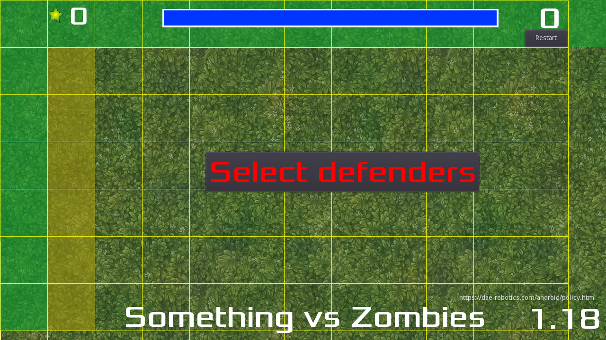
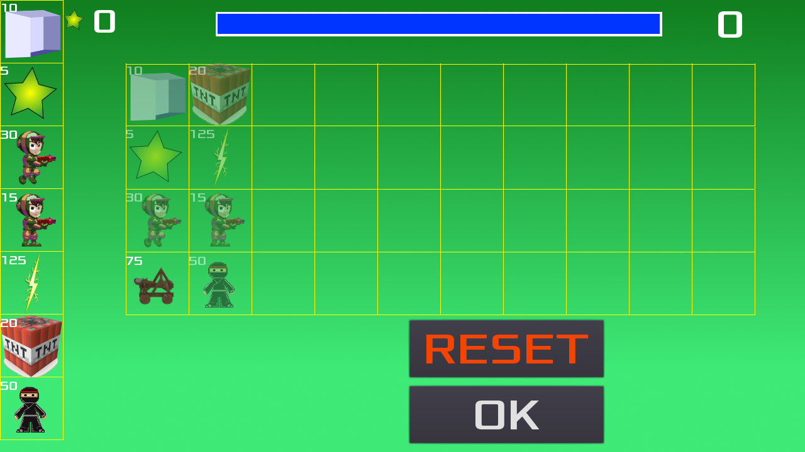
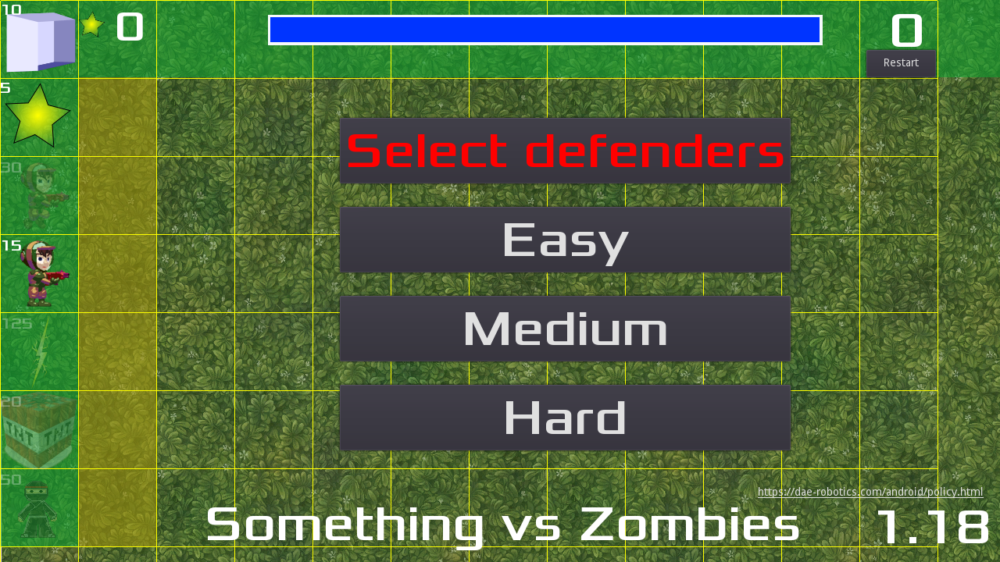
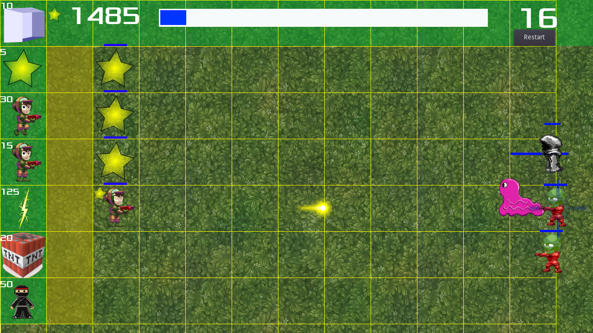
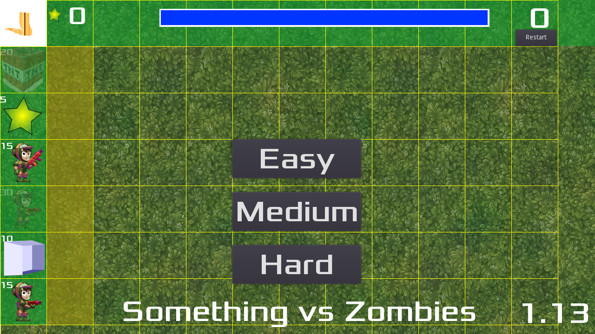
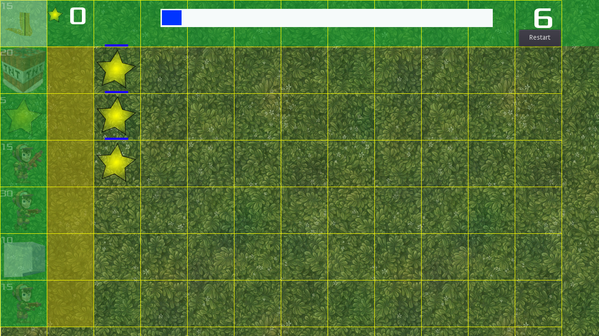
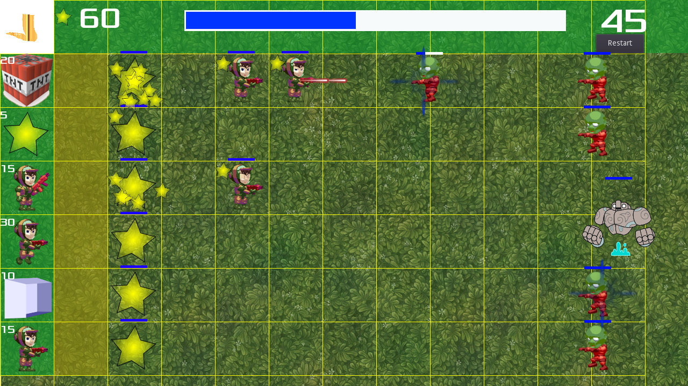
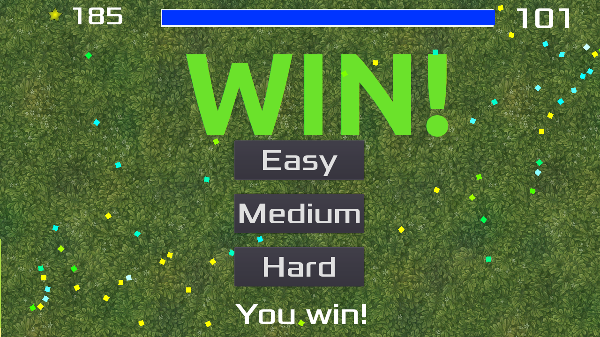

# Something vs Zombies

Plant vs Zombies inspired game to learn [Godot](https://godotengine.org/)

## Copying 

`art/House In a Forest Loop.ogg` Copyright &copy; 2012 [HorrorPen](https://opengameart.org/users/horrorpen), [CC-BY 3.0: Attribution](http://creativecommons.org/licenses/by/3.0/). Source: https://opengameart.org/content/loop-house-in-a-forest

Images are from "Abstract Platformer". Created in 2016 by kenney.nl, [CC0 1.0 Universal](http://creativecommons.org/publicdomain/zero/1.0/). Source: https://www.kenney.nl/assets/abstract-platformer

Font is "Xolonium". Copyright &copy; 2011-2016 Severin Meyer <sev.ch@web.de>, with Reserved Font Name Xolonium, SIL open font license version 1.1. Details are in `fonts/LICENSE.txt`.

* https://opengameart.org/content/lasers-and-beams
* https://pitigamedev.itch.io/side-scroller-character-2d
* https://opengameart.org/content/golem-animations
* https://opengameart.org/content/mummies
* https://opengameart.org/content/tileable-grass-textures-set-1
* https://opengameart.org/content/catapult
* https://opengameart.org/content/electric-buzz
* https://opengameart.org/content/lightning
* https://opengameart.org/content/opp2017-sprites-characters-objects-effects
* https://free-vectors.net/backgrounds/martian-background-vector
* https://free-vectors.net/backgrounds/nature-landscape-vector
* https://free-vectors.net/backgrounds/forest-background-vector
* https://opengameart.org/content/2d-car-pack-0
* https://mixkit.co/free-sound-effects/siren/
* https://pixabay.com/es/illustrations/naturaleza-%C3%A1rbol-%C3%A1rboles-paisaje-4721716/
* https://pixabay.com/es/vectors/la-carretera-lago-monta%C3%B1as-cielo-5899921/
* https://opengameart.org/content/wgstudio-fire-animation-loop
* https://opengameart.org/content/synthesized-fire-sound-effect
